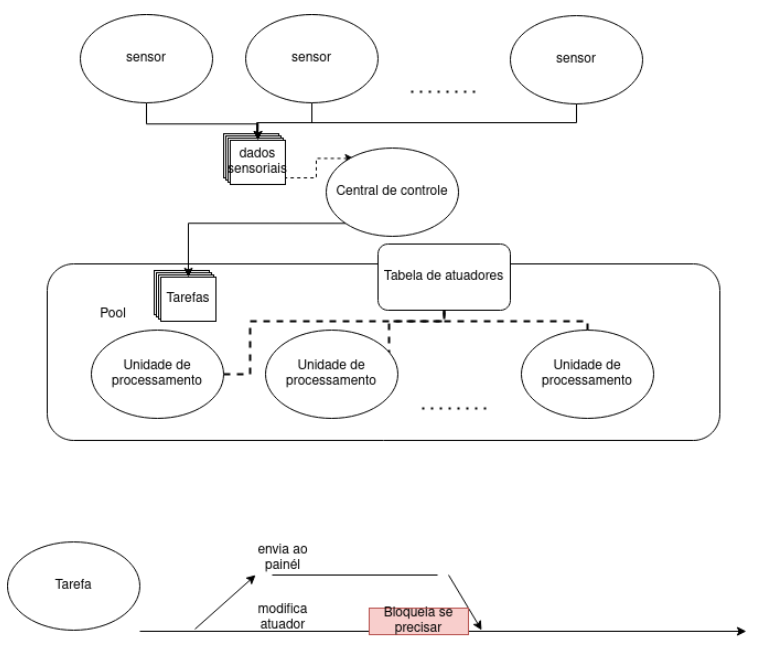

# Parallel Programing with go

First of all, this was an assignment developed in the parallel and distributed programming subject (INE5645). 

This work aims to explore the use of patterns for multithreaded programming. It be will be explored (at least) the producer/consumer, fork-join, and thread pool programming models in solving the problem.

## Problem Description: Automatic Activation System in Autonomous Cars

Autonomous cars rely on a large number of sensors (producers) to recognize the environment as well as the internal conditions of the vehicle. The number of sensor threads should be parameterizable by N_SENSORS. A sensor data point should be a random integer between 0 and 1000, obtained at intervals of 1 to 5 seconds.

The actuators, which are responsible for controlling the vehicle's actions, are accessed through a shared table. Actuators and their activity levels are represented by integers. Access to an actuator is done through a table of type Map<Integer,Integer> or Dict[int,int]. The first integer represents the actuator, while the second represents the activity level. The number of actuators should be parameterizable by N_ACTUATORS, all initialized with activity 0.

One way to transform sensory data into commands for the actuators is by passing the information to a Control Center (consumer). Therefore, for each sensory data ds received, the control center defines an actuator (ds % N_ACTUATORS) and an activity level (random value between 0 and 100). To ensure good performance and response times, the Control Center operates on multiple processing units (thread pool), allowing parallel changes in the behavior of the set of actuators.

A processing unit that wants to change the behavior of an actuator must change the corresponding integer to the desired activity level and maintain it for at least 2 seconds (random value between 2 and 3 seconds). The processing units are also responsible for sending to the vehicle’s dashboard that the actuator is undergoing changes in its activity level (print on the screen “Changing: <actuator> with value <activity level>\n”). This value must be maintained on the dashboard for 1 second (after printing the message, nothing should be printed for 1 second).

For each task received by the processing unit, there are two subtasks (division), which can be executed independently (fork): changing the actuator's activity level and sending the change to the dashboard. Each subtask has an outcome: whether a failure occurred (random chances, 20% chance of failure). Upon completion of the two activities (join), if any of them suffered a failure (combination of the results), a failure message is sent to the dashboard (fork-join). Print on the screen “Failure: <actuator>\n”. 

### Supporting illustration



### Execution

The project was implemented using the Go language in version 1.22.1 linux/amd64. To run the code, just write the following command in the project directory containing the main.go file

```
go run main.go
```
